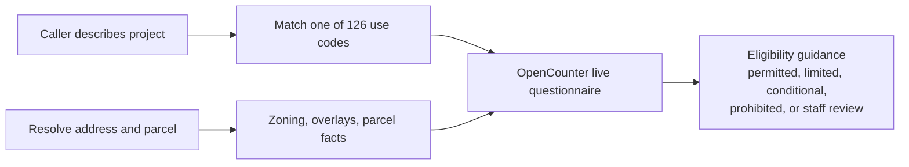

# OpenCounter Catalog and Question Reference

This reference summarizes the Cincinnati OpenCounter zoning use-code catalog
and the question families that may follow each catalog branch.

## Important distinction

- Category, subgroup, and entry counts below come from the packaged OpenCounter
  catalog.
- Potential questions are informed hypotheses, not a stored or guaranteed
  OpenCounter questionnaire.
- Live questions can vary by exact use code, address, zoning and overlays, and
  previous answers.

## Catalog snapshot

- Catalog: `cincinnati-opencounter-zoning-use-catalog-v1`
- Categories: 7
- Total entries: 126
- Unique displayed names: 124

| Category | Direct entries | Grouped entries | Total |
|---|---:|---:|---:|
| Accessory Uses | 13 | 0 | 13 |
| Agriculture and Extractive Uses | 8 | 0 | 8 |
| Commercial Uses | 26 | 11 | 37 |
| Industrial Uses | 3 | 12 | 15 |
| Public and Semipublic Uses | 13 | 3 | 16 |
| Residential Uses | 2 | 18 | 20 |
| Transportation, Communications and Utilities Uses | 7 | 10 | 17 |
| **Total** | **72** | **54** | **126** |

## Catalog branches and potential questions

```mermaid
flowchart LR
    ROOT["OpenCounter Zoning Catalog<br/>126 use-code entries"]

    ROOT --> ACCESSORY["Accessory Uses<br/>13 entries"]
    ACCESSORY --> ACCESSORY_DIRECT["13 direct use codes<br/>Possible prompts:<br/>What is the principal use?<br/>Where will it be located?<br/>Size and height?<br/>Temporary or permanent?<br/>Storage, lighting, fencing, customers?"]

    ROOT --> AGRICULTURE["Agriculture and Extractive Uses<br/>8 entries"]
    AGRICULTURE --> AGRICULTURE_DIRECT["8 direct use codes<br/>Possible prompts:<br/>Crops, animals, extraction, or processing?<br/>Animal type and count?<br/>Structures and equipment?<br/>On-site sales?<br/>Waste, odor, noise, or deliveries?"]

    ROOT --> COMMERCIAL["Commercial Uses<br/>37 entries"]
    COMMERCIAL --> COMMERCIAL_DIRECT["26 direct use codes<br/>Possible prompts:<br/>What goods or services?<br/>New business or change of use?<br/>Floor area and occupancy?<br/>Employees, hours, deliveries, signage?"]
    COMMERCIAL --> VEHICLE["Vehicle and equipment services<br/>6 entries<br/>Possible prompts:<br/>Sales, repair, washing, or fueling?<br/>Vehicles per day?<br/>Service bays?<br/>Outdoor storage?<br/>Fuel, fluids, or hazardous materials?"]
    COMMERCIAL --> FOOD["Eating and drinking establishments<br/>3 entries<br/>Possible prompts:<br/>Food preparation?<br/>Indoor and outdoor seating?<br/>Alcohol service?<br/>Drive-through?<br/>Hours and occupant capacity?"]
    COMMERCIAL --> RECREATION["Recreation and entertainment<br/>2 entries<br/>Possible prompts:<br/>Maximum attendance?<br/>Scheduled events?<br/>Amplified sound?<br/>Food or alcohol?<br/>Indoor or outdoor activity?"]

    ROOT --> INDUSTRIAL["Industrial Uses<br/>15 entries"]
    INDUSTRIAL --> INDUSTRIAL_DIRECT["3 direct use codes<br/>Possible prompts:<br/>Facility activity?<br/>Floor and outdoor area?<br/>Operating hours?<br/>Materials handled?<br/>Truck and freight activity?"]
    INDUSTRIAL --> PRODUCTION["Production industry<br/>4 entries<br/>Possible prompts:<br/>What is manufactured?<br/>Processes and equipment?<br/>Hazardous materials?<br/>Noise, odor, emissions, or wastewater?"]
    INDUSTRIAL --> WAREHOUSING["Warehousing and storage<br/>5 entries<br/>Possible prompts:<br/>What is stored?<br/>Indoor or outdoor storage?<br/>Loading docks and truck frequency?<br/>Cold storage?<br/>Hours and staffing?"]
    INDUSTRIAL --> WASTE["Waste management<br/>3 entries<br/>Possible prompts:<br/>Waste type and volume?<br/>Collection, transfer, or processing?<br/>Outdoor storage?<br/>Odor, dust, noise, or runoff?<br/>Required licenses?"]

    ROOT --> PUBLIC["Public and Semipublic Uses<br/>16 entries"]
    PUBLIC --> PUBLIC_DIRECT["13 direct use codes<br/>Possible prompts:<br/>Institution or service type?<br/>Occupants and visitors?<br/>Hours and events?<br/>Classrooms or assembly space?<br/>Drop-off, parking, and outdoor activity?"]
    PUBLIC --> GOVERNMENT["Government Facilities and Offices<br/>3 entries<br/>Possible prompts:<br/>Agency function?<br/>Public access?<br/>Employees and visitors?<br/>Fleet vehicles?<br/>Security or emergency operations?"]

    ROOT --> RESIDENTIAL["Residential Uses<br/>20 entries"]
    RESIDENTIAL --> RESIDENTIAL_DIRECT["2 direct day-care-home uses<br/>Possible prompts:<br/>Adult or child care?<br/>Number receiving care?<br/>Resident operator?<br/>Outside employees?<br/>Hours and licensing?"]
    RESIDENTIAL --> CARE["Residential care facilities<br/>5 entries<br/>Possible prompts:<br/>Number of residents?<br/>Staffing and supervision?<br/>Personal or medical services?<br/>Length of stay?<br/>State licensing?"]
    RESIDENTIAL --> PERMANENT["Permanent residential<br/>6 entries<br/>Attached SF, multifamily, rowhouse SF,<br/>single-family, three-family, two-family<br/>Possible prompts:<br/>How many units?<br/>One building or several?<br/>New construction or conversion?<br/>Attached or detached?<br/>Existing and proposed units?"]
    RESIDENTIAL --> GROUP["Group residential<br/>7 entries<br/>Possible prompts:<br/>Residents or rooms?<br/>Communal dining and living areas?<br/>Operator or sponsoring organization?<br/>Services provided?<br/>Temporary or permanent occupancy?"]

    ROOT --> TRANSPORT["Transportation, Communications<br/>and Utilities Uses<br/>17 entries"]
    TRANSPORT --> TRANSPORT_DIRECT["7 direct use codes<br/>Possible prompts:<br/>Utility or infrastructure type?<br/>Equipment and service area?<br/>Tower or antenna height?<br/>Rights-of-way?<br/>Noise and operating hours?"]
    TRANSPORT --> FACILITIES["Transportation facilities<br/>5 entries<br/>Possible prompts:<br/>Passenger or freight?<br/>Vehicle and trip counts?<br/>Routes and loading areas?<br/>Outdoor storage?<br/>Hours of operation?"]
    TRANSPORT --> WATER["Watercraft and riverfront facilities<br/>5 entries<br/>Possible prompts:<br/>Facility and vessel type?<br/>Number of slips or docks?<br/>Fueling or repair?<br/>Public river access?<br/>Seasonal operations?"]
```



Accessory Uses and Agriculture and Extractive Uses are flat catalog branches.
The other five categories contain one or more nested subgroups.

## Caller-to-guidance flow



The system should supply address-derived property facts automatically. The
requester should answer only facts about the proposed project that cannot be
reliably derived from the address, parcel, zoning, overlays, or prior answers.

## Source

The canonical packaged catalog is
[`catalog/cincinnati-opencounter-zoning-use-catalog-v1.json`](catalog/cincinnati-opencounter-zoning-use-catalog-v1.json).

When recounting entries, include both direct and grouped entries:

```text
categories[].entries[]
categories[].groups[].entries[]
```
