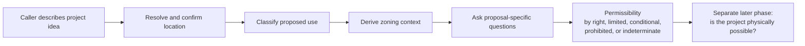

# OpenCounter Catalog and Question Reference

This reference summarizes the Cincinnati OpenCounter zoning use-code catalog
and the question families that may follow each catalog branch.

## Important distinction

- Category, subgroup, and entry counts below come from the packaged OpenCounter
  catalog.
- Potential questions are informed hypotheses, not a stored or guaranteed
  OpenCounter questionnaire.
- Live questions can vary by exact use code, address, zoning and overlays, and
  previous answers.

## Catalog snapshot

- Catalog: `cincinnati-opencounter-zoning-use-catalog-v1`
- Categories: 7
- Total entries: 126
- Unique displayed names: 124

| Category | Direct entries | Grouped entries | Total |
|---|---:|---:|---:|
| Accessory Uses | 13 | 0 | 13 |
| Agriculture and Extractive Uses | 8 | 0 | 8 |
| Commercial Uses | 26 | 11 | 37 |
| Industrial Uses | 3 | 12 | 15 |
| Public and Semipublic Uses | 13 | 3 | 16 |
| Residential Uses | 2 | 18 | 20 |
| Transportation, Communications and Utilities Uses | 7 | 10 | 17 |
| **Total** | **72** | **54** | **126** |

## Catalog branches and potential questions

```mermaid
flowchart LR
    ROOT["OpenCounter Zoning Catalog<br/>126 use-code entries"]

    ROOT --> ACCESSORY["Accessory Uses<br/>13 entries"]
    ACCESSORY --> ACCESSORY_DIRECT["13 direct use codes<br/>Possible prompts:<br/>What is the principal use?<br/>Where will it be located?<br/>Size and height?<br/>Temporary or permanent?<br/>Storage, lighting, fencing, customers?"]

    ROOT --> AGRICULTURE["Agriculture and Extractive Uses<br/>8 entries"]
    AGRICULTURE --> AGRICULTURE_DIRECT["8 direct use codes<br/>Possible prompts:<br/>Crops, animals, extraction, or processing?<br/>Animal type and count?<br/>Structures and equipment?<br/>On-site sales?<br/>Waste, odor, noise, or deliveries?"]

    ROOT --> COMMERCIAL["Commercial Uses<br/>37 entries"]
    COMMERCIAL --> COMMERCIAL_DIRECT["26 direct use codes<br/>Possible prompts:<br/>What goods or services?<br/>New business or change of use?<br/>Floor area and occupancy?<br/>Employees, hours, deliveries, signage?"]
    COMMERCIAL --> VEHICLE["Vehicle and equipment services<br/>6 entries<br/>Possible prompts:<br/>Sales, repair, washing, or fueling?<br/>Vehicles per day?<br/>Service bays?<br/>Outdoor storage?<br/>Fuel, fluids, or hazardous materials?"]
    COMMERCIAL --> FOOD["Eating and drinking establishments<br/>3 entries<br/>Possible prompts:<br/>Food preparation?<br/>Indoor and outdoor seating?<br/>Alcohol service?<br/>Drive-through?<br/>Hours and occupant capacity?"]
    COMMERCIAL --> RECREATION["Recreation and entertainment<br/>2 entries<br/>Possible prompts:<br/>Maximum attendance?<br/>Scheduled events?<br/>Amplified sound?<br/>Food or alcohol?<br/>Indoor or outdoor activity?"]

    ROOT --> INDUSTRIAL["Industrial Uses<br/>15 entries"]
    INDUSTRIAL --> INDUSTRIAL_DIRECT["3 direct use codes<br/>Possible prompts:<br/>Facility activity?<br/>Floor and outdoor area?<br/>Operating hours?<br/>Materials handled?<br/>Truck and freight activity?"]
    INDUSTRIAL --> PRODUCTION["Production industry<br/>4 entries<br/>Possible prompts:<br/>What is manufactured?<br/>Processes and equipment?<br/>Hazardous materials?<br/>Noise, odor, emissions, or wastewater?"]
    INDUSTRIAL --> WAREHOUSING["Warehousing and storage<br/>5 entries<br/>Possible prompts:<br/>What is stored?<br/>Indoor or outdoor storage?<br/>Loading docks and truck frequency?<br/>Cold storage?<br/>Hours and staffing?"]
    INDUSTRIAL --> WASTE["Waste management<br/>3 entries<br/>Possible prompts:<br/>Waste type and volume?<br/>Collection, transfer, or processing?<br/>Outdoor storage?<br/>Odor, dust, noise, or runoff?<br/>Required licenses?"]

    ROOT --> PUBLIC["Public and Semipublic Uses<br/>16 entries"]
    PUBLIC --> PUBLIC_DIRECT["13 direct use codes<br/>Possible prompts:<br/>Institution or service type?<br/>Occupants and visitors?<br/>Hours and events?<br/>Classrooms or assembly space?<br/>Drop-off, parking, and outdoor activity?"]
    PUBLIC --> GOVERNMENT["Government Facilities and Offices<br/>3 entries<br/>Possible prompts:<br/>Agency function?<br/>Public access?<br/>Employees and visitors?<br/>Fleet vehicles?<br/>Security or emergency operations?"]

    ROOT --> RESIDENTIAL["Residential Uses<br/>20 entries"]
    RESIDENTIAL --> RESIDENTIAL_DIRECT["2 direct day-care-home uses<br/>Possible prompts:<br/>Adult or child care?<br/>Number receiving care?<br/>Resident operator?<br/>Outside employees?<br/>Hours and licensing?"]
    RESIDENTIAL --> CARE["Residential care facilities<br/>5 entries<br/>Possible prompts:<br/>Number of residents?<br/>Staffing and supervision?<br/>Personal or medical services?<br/>Length of stay?<br/>State licensing?"]
    RESIDENTIAL --> PERMANENT["Permanent residential<br/>6 entries<br/>Attached SF, multifamily, rowhouse SF,<br/>single-family, three-family, two-family<br/>Possible prompts:<br/>How many units?<br/>One building or several?<br/>New construction or conversion?<br/>Attached or detached?<br/>Existing and proposed units?"]
    RESIDENTIAL --> GROUP["Group residential<br/>7 entries<br/>Possible prompts:<br/>Residents or rooms?<br/>Communal dining and living areas?<br/>Operator or sponsoring organization?<br/>Services provided?<br/>Temporary or permanent occupancy?"]

    ROOT --> TRANSPORT["Transportation, Communications<br/>and Utilities Uses<br/>17 entries"]
    TRANSPORT --> TRANSPORT_DIRECT["7 direct use codes<br/>Possible prompts:<br/>Utility or infrastructure type?<br/>Equipment and service area?<br/>Tower or antenna height?<br/>Rights-of-way?<br/>Noise and operating hours?"]
    TRANSPORT --> FACILITIES["Transportation facilities<br/>5 entries<br/>Possible prompts:<br/>Passenger or freight?<br/>Vehicle and trip counts?<br/>Routes and loading areas?<br/>Outdoor storage?<br/>Hours of operation?"]
    TRANSPORT --> WATER["Watercraft and riverfront facilities<br/>5 entries<br/>Possible prompts:<br/>Facility and vessel type?<br/>Number of slips or docks?<br/>Fueling or repair?<br/>Public river access?<br/>Seasonal operations?"]
```



Accessory Uses and Agriculture and Extractive Uses are flat catalog branches.
The other five categories contain one or more nested subgroups.

## Caller-to-guidance flow



The user-facing entry point is the project idea plus a location, not a parcel
fact sheet. After the location is resolved, the system derives zoning and other
site facts as needed. The requester answers only proposal facts that cannot be
reliably derived from the location, zoning context, or prior answers.

## Observed question library

The current catalog-wide first pass is defined in
[`catalog/zoning-question-discovery-zone-portfolio-first-pass.json`](catalog/zoning-question-discovery-zone-portfolio-first-pass.json).
It covers all 126 use codes across a private portfolio representing 37
Cincinnati base-zone contexts: 126 planned provider projects, with each context
assigned three or four uses. Planning is rejected without exact 126-project
authorization and a complete verified portfolio. The public definition contains
the zone taxonomy but no addresses. The earlier one-location 126-job definition
and 18-project Permanent Residential definition remain compatibility and
calibration fixtures, respectively.

Private address fixtures must be validated with a full parcel-polygon
intersection against the official CAGIS zoning layer. A scalar zoning value or
address point can hide a split-zone parcel and is not sufficient for campaign
admission. If a completed provider result reports zoning incompatible with its
assigned base code, the ledger fences new starts, preserves every existing
project, and moves only never-started catalog entries into a corrected,
digest-bound residual campaign.

This first pass does not test every use in every zone. The full base matrix is
126 × 37 = 4,662 projects before branching, and overlays can create additional
contexts. Expansion should be adaptive and separately authorized.

The public adaptive v1 policy uses only address-free evidence from the exact
freeze and schema-v3 questionnaire. It compares entries only within their exact
catalog category or subgroup, prioritizes observed Prohibited outcomes and
question/terminal divergence, then selects at most two unobserved zoning
sampling strata per use. The 10 strata cover the exact 37-code taxonomy and are
sampling devices, not legal-equivalence classes. The hard ceiling is 48
candidate projects at concurrency two; callers may lower those limits but may
not raise them. The generated artifact is provisional until Scenario Wave 1 is
actually complete and never grants authorization or makes a saturation claim.

Each run is governed by the durable local ledger described in the stack
README. Workers lease one validated action at a time, persist mutation intent
before a provider call. The exact confirmed address may advance only through a
single-question location checkpoint with one matching provider option. Unknown
substantive questions stop in `needs_input`; uncertain provider effects stop in
`indeterminate` and can proceed only through same-project reconciliation.

The graph derived from completed ledger observations records:

- provider question ID and normalized prompt/type/options signature;
- required status and exact displayed options;
- catalog entries, category paths, location fixtures, expected/observed zoning,
  overlay flags, and scenarios where seen;
- exact answer-to-next-question or answer-to-terminal-result edges;
- first and last observation times; and
- total and independent-job observation counts.

This remains an **observed** library. It is not an exhaustive representation of
all branches OpenCounter could display. The first-pass campaign has an empty
answer-rule set, so no substantive live answer is inferred. The 126 projects
reveal the first observed question layer; additional fresh projects are
authorized separately when controlled answer branches need to be explored.

The private schema-v3 master-questionnaire artifact is derived only after the
freeze and every exact source snapshot revalidate. It normalizes the 93 current
signatures into 51 provider-question families and retains 40 currently observed
answer transitions. Each transition is scoped to the exact catalog entries,
zoning contexts, overlays, fixtures, and scenarios that produced it, and a
terminal transition carries the exact observed OpenCounter classification,
including an explicit null when the provider supplied none. These counts are
an evidence snapshot, not a completeness claim.

The provider-free preliminary-guidance evaluator consumes that artifact only
after a separate resolver supplies parcel/zoning evidence and the requester
confirms one or more catalog-use candidates. It never converts use-only or
different-zone evidence into a local outcome. Exact paths can yield only a
preliminary classification; incomplete or conflicting paths yield
`insufficient_information` and may recommend OpenCounter confirmation without
authorizing or dispatching a provider project.

Validation cases compare one content-addressed preliminary decision with an
exact known-project provider read-back. Reports retain raw classification and
question-prediction counts alongside accuracy, precision, and recall; an
unclassified provider result is not silently scored as correct or incorrect.
Questionnaire drift reports compare canonical question content, identify the
affected catalog entries, and distinguish targeted evidence reruns from a full
tenant/catalog refresh. A maintenance recommendation is not project-volume
authorization.

A controlled scenario-branch wave must classify every non-address answer rule
by ownership and provenance: either a proposal fact or a site/location-derived
fact.

Only generic, portable, address-free definitions, source, documentation, and tests—and explicitly synthetic fixtures—may ship publicly for OpenCounter scenario waves.
Requester-approved previews and approvals, observation freezes, exact
source-ledger snapshots, parcel- and fact-specific evidence, and generated
scenario ledgers are private RUDI runtime state. Private state directories use
mode `0700`; files use mode `0600`.

An observation freeze is a private, content-addressed manifest. It may bind
rather than embed full source ledgers only when the exact snapshots are retained
immutably. The planner must canonicalize the source manifest before computing
`evidenceSetSha256`, rehash every retained snapshot, and require exact
no-extra/no-missing equality with the canonical source manifest. Planning must
fail closed when any snapshot is unavailable or mismatched.

Requester approval must bind `previewSha256` and the exact scenario ID, scenario
version, normalized question signature, answer value, and ownership tuple for
every rule. Approval for a site/location-derived rule must additionally bind the
exact frozen source-ledger snapshot cryptographically bound by the observation
freeze and fact-specific, parcel-specific evidence for the same parcel. Generic
fixture evidence, equality with an expected base-zone value, and membership in
the provider's displayed options are insufficient proof. Planning must fail
closed before any provider project starts if any rule lacks its required proof.
This boundary does not prohibit a separately authorized empty-answer
observation campaign.

Rule ownership is closed to `proposal_fact`, `site_fact`, and `mixed_fact`.
Proposal and mixed rules carry a deterministic, hash-bound declaration that the
answer is an explicitly synthetic coverage fact and is not a real project fact.
Site rules carry only content-addressed parcel evidence; mixed rules require
both forms of provenance. A schema-v2 readiness report must exactly match every
required site or mixed assertion before preview construction. Extra historical
artifacts are ignored and cannot fill a missing requirement.

### Bounded branch-wave evidence

The 20-run first branch wave measures first-pass provider-question-ID coverage.
It can earn only `scenario_wave_1_complete`; it does not measure normalized
signature, answer-value, or transition coverage, does not establish
answer-branch completeness, and must never be reported as
`answer_branch_complete`.

The strongest later empirical status is
`branch_frontier_stable_for_manifest(M)` as of one fixed observation epoch.
`M` must be a private, content-addressed, requester-approved manifest that
finitely closes:

- the exact catalog identity and entries, plus provider identity, fingerprint,
  and version;
- the exact verified location, context, base-zone, and overlay set;
- a finite answer vocabulary that excludes free text or enumerates every
  permitted free-text value;
- maximum branch depth, per-wave and total project caps, and validity window;
- exact source-snapshot digests; and
- provenance for every answer rule.

At sweep `k`, freeze frontier `F_k`. Each frontier cell is keyed by
`providerQuestionId` plus normalized signature, exact source-checkpoint
question set, full prior answer prefix, complete answer vector,
`catalogEntryId`, and exact context key. A cell counts only after authoritative
provider read-back proves the exact next checkpoint set or terminal result. A complete
sweep covers every cell in `F_k` and leaves each either at a verified terminal
or at an explicitly approved out-of-scope boundary, with no queued, active, failed,
indeterminate, or unverified in-scope work. In-scope `needs_input` remains
incomplete.

Novelty means a new question identity, option or value, transition, or in-scope
context association. Any novelty resets the stability streak and requires a
new preview and approval. Provider, catalog, fingerprint, or context-evidence
drift invalidates `M`. Declare stability only after two independently executed,
separately authorized complete sweeps have the same `M` digest and frontier
digest and zero novelty. Observations outside `M` do not reset the streak;
expanding scope versions `M` and restarts it. Reaching a cap yields
`wave_complete_scope_unsaturated`, never a global exhaustive or
answer-branch-complete claim.

The provider-free frontier-stability module enforces this evidence rule. Its
finite manifest binds exact catalog/provider/context evidence, enumerated
answer values and provenance, cell keys, limits, validity, and source
snapshots. A sweep counts only with exact preview-bound authorization evidence
and one result per cell. Separate sweeps must use distinct authorization IDs,
preview hashes, provider projects, and execution-evidence digests. Any novelty
under `M` permanently requires a versioned replacement for `M`; later repeats
cannot erase it. The evaluator refuses total volume beyond the manifest cap and
emits no stability claim for one sweep, incomplete work, novelty, or cap
exhaustion.

This is an evaluation contract, not authorization or provider execution. The
first real manifest cannot be produced until authorized Scenario Wave 1
read-backs expose the next frontier.

The implementation validates exact rule provenance, frozen snapshots,
content-addressed site evidence, preview-bound approval, and answer dispatch.
A generated preview is still provider-free and is not approval. The 20 runs
remain prohibited until the requester explicitly authorizes the exact
`previewSha256` and volume.

## Source

The canonical packaged catalog is
[`catalog/cincinnati-opencounter-zoning-use-catalog-v1.json`](catalog/cincinnati-opencounter-zoning-use-catalog-v1.json).

When recounting entries, include both direct and grouped entries:

```text
categories[].entries[]
categories[].groups[].entries[]
```
